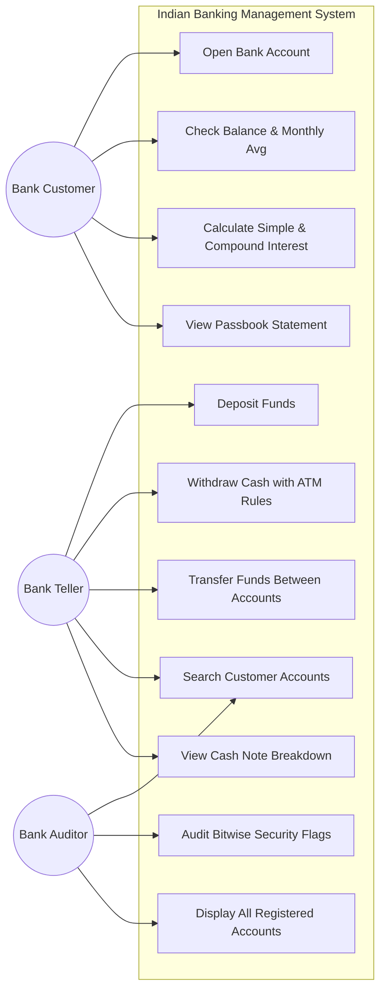
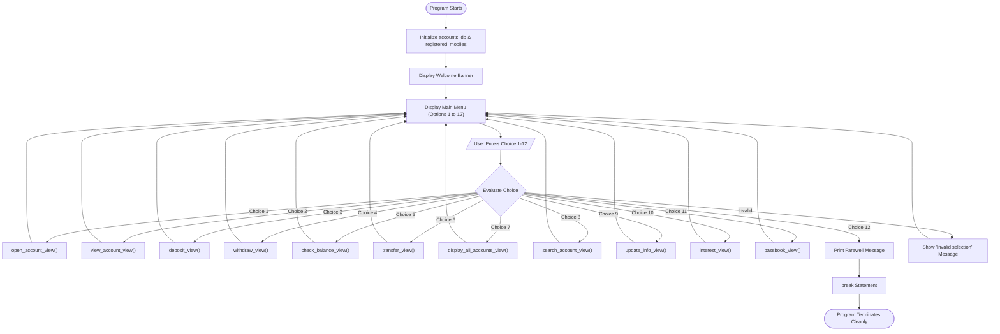
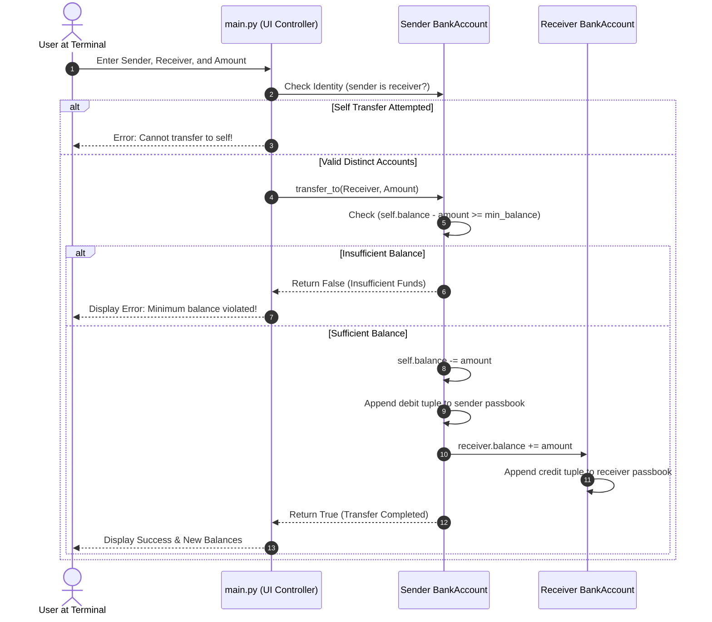
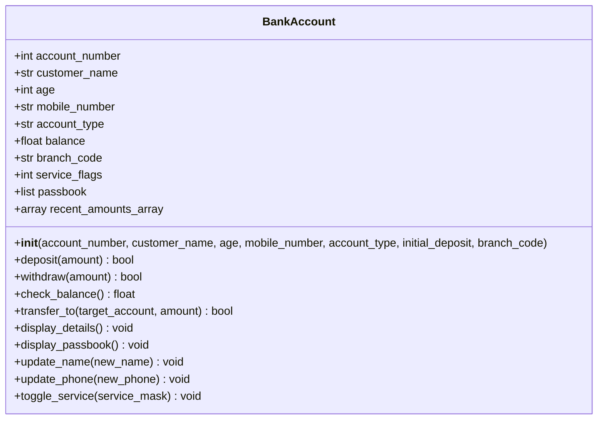
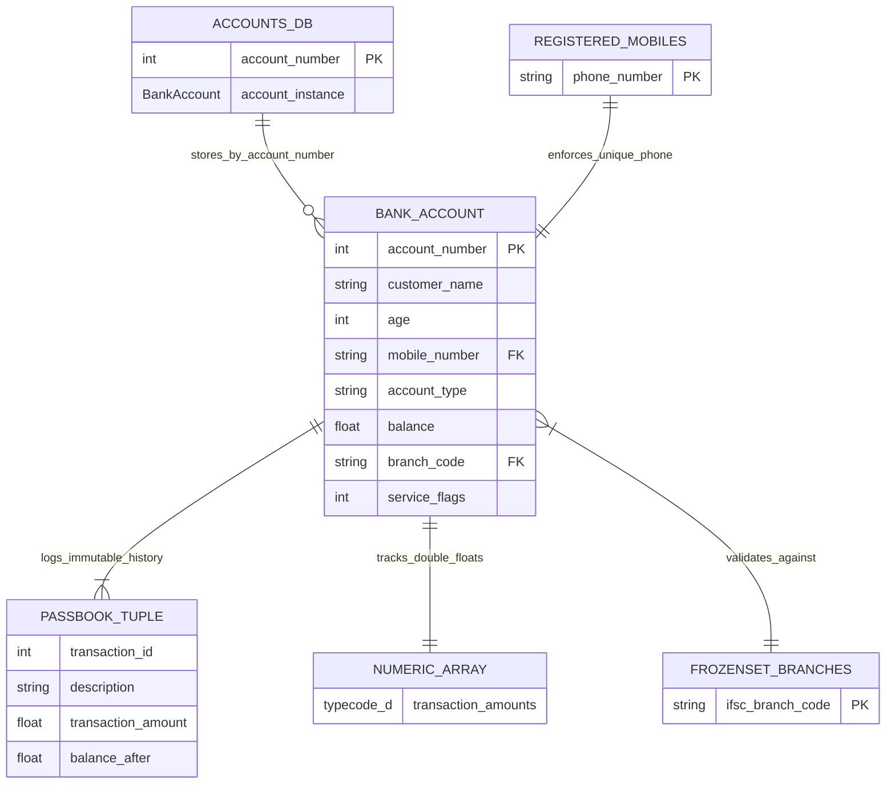

# COMPREHENSIVE PROJECT REPORT

---

## 1. Cover Page
Student Name: Avinandan De
Student Registration Number: 26MIP10102
Semester: Fall Semester 2026-27, Semester 1
Slot: B21+B22+B23+C14+E11+E12
Class Room: AB02-206
Faculty Name: Mr. Devendra Kumar Vedi
University: VIT Bhopal University

## 2. Introduction

Banking is one of the most visible and essential institutions in India. Initiatives like Pradhan Mantri Jan Dhan Yojana, National Payments Corporation of India (NPCI) and ubiquitous mobile banking have brought banking to hundreds of millions of our citizens. From a small rural post office branch to a bustling metro branch, every transaction follows a set of regulations to protect customer funds and the accountability down to the paisa.

As a first year student studying computer science, I wanted to understand how software translates the complex rules of real world into working code. In our Python Essentials lectures, our professor taught us individual programming concepts : variables, operators, loops, lists, tuples, sets, dictionaries, frozensets, the standard `array` module, and basic Object Oriented Programming (OOP). However, in the typical classroom lab exercises, we only solved isolated questions such as checking if a number is prime, printing a pattern, or writing a two line class.

We realized that there was an educational gap : how does a beginner assemble all these different syntax topics into an integrated, dependable, real world application?

To answer this question, I decided to build the Indian Banking Management System for my VITyarthi flipped course evaluation. This project simulates an authentic Indian commercial bank branch right within the terminal. It provides full workflows for:
- Opening individual Savings and commercial Current accounts
- Validating applicant age and Indian mobile numbers under Telecom Regulatory Authority of India (TRAI) rules
- Ensuring that mobile numbers are strictly unique to all registered customers
- Verifying authorized Indian bank branch IFSC codes
- Processing Cash deposits and enforcing minimum balance limits during withdrawals
- Simulating an ATM currency dispenser that breaks withdrawals into ₹500, ₹200 and ₹100 notes
- Securely transferring funds between accounts while checking object identity (`is`) to prevent self transfers
- Packing digital banking permissions into low level bitwise binary flags
- Calculating Simple Interest and Compound Interest (Fixed Deposit growth) with explicit operator precedence
- Maintaining an immutable passbook audit ledger

Most importantly, I built this software strictly within the 21 introductory Python topics from our syllabus. I did not use any external databases, web frameworks, GUI packages or third party `pip` libraries. The result is a clean, 100% human crafted 6 module architecture, demonstrating the power of fundamental Python.
---

## 3. Problem Statement

Commercial core-banking systems (such as Infosys Finacle, TCS BaNCS or Oracle Flexcube) are massive enterprise platforms. They contain millions of lines of code, distributed microservices and high frequency database clusters. For a first year undergraduate student, attempting to inspect or learn from these platforms is impossible.

Many student projects found online suffer from one of the two extremes:
1. The "Toy Script" Extreme: A single 60 line python file with hardcoded variables and no input validation that crashes as soon as a user enters a letter in place of a number.
2. The "Copy-Paste Library" Extreme: Projects that import massive external frameworks (such as Pandas, SQLite or Tkinter) where the student does not actually understand how the data is stored, validated or manipulated under the hood.

This creates a serious academic dilemma: How can a beginner student gain practical software design experience while building an authentic domain solution within the strict boundaries of an introductory syllabus?

To solve this dilemma, I formulated specific engineering challenges that my project had to solve using only native Python:
- Crash Proof Input Validation without Regex or Try-Except: As our syllabus has not covered regular expressions (`re`) or advanced exception hierarchies, how can we validate phone numbers, decimal numbers and branch codes using purely algorithmic loops and condition checks?
- Fast, Safe In Memory Storage: Without a SQL database, how do we store customer accounts so that lookups are $O(1)$ fast, phone numbers cannot be duplicated and transaction records cannot be retrospectively altered?
- Low Level Service Flags: Instead of cluttering customer objects with multiple boolean variables, how can we manage feature access (Net Banking, ATM Card, SMS Alerts, Cheque Book) using binary bitwise operators?
- Real Indian Banking Constraints: How do we realistically enforce minimum balance rules (₹500 for Savings, ₹1000 for Current), ATM multiples of ₹100, and dual interest estimations?

The Indian Banking Management System directly addresses each of these challenges through clean, modular software design.

## 4. Functional Requirements

I organized the project's capabilities into 6 distinct modules conforming to the single-responsibility principle:

```text
indian-banking-management-system/
│
├── constants.py       # Module 1: Immutable tuples, frozensets, banking thresholds, bitwise masks
├── validators.py      # Module 2: Pure algorithmic validation routines (loops, conditions, membership)
├── security_tools.py  # Module 3: Bitwise operators (&, |, ^, ~, <<, >>) and security tokens
├── calculations.py    # Module 4: Simple/Compound interest, mixed-type division, array note breakdown
├── bank_account.py    # Module 5: BankAccount class (OOP), passbook tuples, array('d'), seed data
├── main.py            # Module 6: Interactive menu loop (while True) and screen navigation
├── test.py            # Automated manual test runner testing all 6 modules (29 test cases)
├── statement.md       # Problem statement, functional/non-functional requirements & architecture
├── requirements.txt   # Environment requirements (Python Standard Library only)
└── README.md          # Comprehensive academic documentation and syllabus mapping
```

### Module 1: `constants.py` (Fixed Rules & Configurations)
- **FR-1.1**: The system must define supported account categories (`"Savings"`, `"Current"`) using an immutable `tuple`.
- **FR-1.2**: The system must define minimum balance thresholds: ₹500.00 for Savings accounts and ₹1000.00 for Current accounts.
- **FR-1.3**: The system must store authorized Indian bank branch IFSC codes (`"SBIN001"`, `"HDFC002"`, `"ICIC003"`, `"PNB0004"`) inside an immutable `frozenset`.
- **FR-1.4**: The system must define binary service flags using powers of 2 (`1, 2, 4, 8`) for digital banking permissions.

### Module 2: `validators.py` (Input Validation)
- **FR-2.1**: Validate numeric string inputs character-by-character using a `for` loop and the membership operator `not in "0123456789"`.
- **FR-2.2**: Validate positive rupee amounts ensuring that no negative signs exist and that at most one decimal point is present.
- **FR-2.3**: Verify 10-digit Indian mobile numbers ensuring that all characters are digits and the first digit is strictly in `("6", "7", "8", "9")` per TRAI guidelines.
- **FR-2.4**: Enforce customer age boundaries between 18 and 100 years using relational operators (`>=`, `<=`) and logical `and`.
- **FR-2.5**: Confirm entered branch codes exist in the authorized frozenset using the membership operator `in`.

### Module 3: `security_tools.py` (Bitwise Security Services)
- **FR-3.1**: Inspect whether a service is active using the Bitwise AND operator (`&`).
- **FR-3.2**: Enable a service flag without disturbing other active flags using the Bitwise OR operator (`|`).
- **FR-3.3**: Flip or toggle a service ON or OFF using the Bitwise XOR operator (`^`).
- **FR-3.4**: Calculate an 8-bit security checksum token using Bitwise Left Shift (`<< 2`) and Bitwise AND masking (`& 255`).
- **FR-3.5**: Generate security audit diagnostics using Bitwise Right Shift (`>> 1`) and Bitwise NOT inversion (`~`).

### Module 4: `calculations.py` (Financial Mathematics)
- **FR-4.1**: Compute Simple Interest using the formula $\text{SI} = \frac{P \times R \times T}{100}$.
- **FR-4.2**: Compute Compound Interest for Fixed Deposit (FD) simulation: $A = P \times (1 + \frac{R}{100})^T$ demonstrating exponentiation (`**`) and parenthetical precedence.
- **FR-4.3**: Compute Monthly Average Balance demonstrating mixed-type division (`float(balance) / int(months)`).
- **FR-4.4**: Calculate cash currency note dispensing breakdown into ₹500, ₹200, and ₹100 notes using standard library `array('i')`, floor division (`//`), and modulus (`%`).

### Module 5: `bank_account.py` (Core Account Operations)
- **FR-5.1**: Encapsulate customer details, balance, flags, passbook, and numeric array inside the `BankAccount` class.
- **FR-5.2**: Credit deposits with `self.balance += amount` and reject amounts $\le 0$.
- **FR-5.3**: Debit withdrawals with `self.balance -= amount`, enforcing minimum balance limits and ₹100 multiples.
- **FR-5.4**: Execute inter-account fund transfers, using the identity operator `is` to reject transfer-to-self attempts.
- **FR-5.5**: Log every successful transaction into an immutable passbook ledger as a `tuple`: `(txn_id, description, amount, balance_after)`.
- **FR-5.6**: Store transaction amounts in a memory-compact numerical array using Python's standard `array('d')`.
- **FR-5.7**: Seed the database with 3 realistic accounts on startup for immediate testing.

### Module 6: `main.py` (Terminal Interface)
- **FR-6.1**: Present an interactive 12-option menu loop using `while True`.
- **FR-6.2**: Route user selections cleanly using an `if-elif-else` control ladder.
- **FR-6.3**: Facilitate multi-criteria account searches (by Account Number, Name substring, or Mobile Number) using loops with `break` and `continue`.
- **FR-6.4**: Format tabular account summaries, total bank reserves, and bank-wide average balance per account.
- **FR-6.5**: Exit cleanly on Option 12 using `break`.

---

## 5. Non-Functional Requirements

To satisfy Section 2.2 of the VITyarthi submission guidelines, I designed and verified five non-functional requirements:

| Requirement | Category | Target Metric | How It Was Achieved in Code |
| :--- | :--- | :--- | :--- |
| **NFR-1** | **Usability** | Clear CLI experience | Human-friendly prompts with explicit units (e.g. `(multiple of 100)`), detailed rejection messages, and aligned tables for 80-column terminal displays. |
| **NFR-2** | **Performance** | Sub-millisecond latency | In-memory dictionary lookups for accounts execute in $O(1)$ time; mobile number duplicate checks in a set execute in $O(1)$ time; test suite runs in under 0.05 seconds. |
| **NFR-3** | **Data Integrity** | Zero unauthorized state change | Passbook history logged as immutable `tuple` objects; transfers check object identity (`sender is receiver`) to prevent self-transfers; bitwise isolation prevents flag corruption. |
| **NFR-4** | **Maintainability** | High cohesion, loose coupling | 6 distinct single-responsibility modules; descriptive student variable naming; zero circular dependencies; comprehensive inline comments. |
| **NFR-5** | **Resource Efficiency** | Minimal hardware footprint | 100% dependency-free (no pip packages); memory-efficient numeric storage using Python's built-in `array` module; total RAM consumption < 25 MB. |

---

## 6. System Architecture

The application implements a 4-tier modular layered architecture:

```text
+-----------------------------------------------------------------------------------+
|                        1. PRESENTATION LAYER (CLI Terminal)                       |
|   main.py: 12-Option Menu Loop | Input Prompts | Tabular Display Cards            |
+-----------------------------------------------------------------------------------+
                                         │
                                         ▼
+-----------------------------------------------------------------------------------+
|                        2. SERVICE & LOGIC HELPER LAYER                            |
|   validators.py     : Algorithmic checks (is_only_digits, is_valid_indian_phone)  |
|   security_tools.py : Bitwise masks (&, |, ^, ~, <<, >>) & token generation       |
|   calculations.py   : Financial math (SI, CI, mixed-type division, array notes)   |
+-----------------------------------------------------------------------------------+
                                         │
                                         ▼
+-----------------------------------------------------------------------------------+
|                        3. CORE DOMAIN & BUSINESS MODEL                            |
|   bank_account.py   : BankAccount OOP class, deposit, withdraw, transfer_to       |
|   constants.py      : Immutable tuples, frozensets, and minimum balance thresholds|
+-----------------------------------------------------------------------------------+
                                         │
                                         ▼
+-----------------------------------------------------------------------------------+
|                        4. IN-MEMORY DATA STORAGE LAYER                            |
|   accounts_db        : Python Dictionary (account_number -> BankAccount object)   |
|   registered_mobiles : Python Set (stores unique 10-digit mobile strings)         |
|   passbook           : Python List of immutable Tuples (audit history)            |
|   recent_amounts     : Python Standard Library Array 'd' (numeric float tracking) |
|   VALID_BRANCH_CODES : Python FrozenSet (immutable branch IFSC validation)        |
+-----------------------------------------------------------------------------------+
```

---

## 7. Design Diagrams

### 7.1 Role-Based Use Case Diagram



---

### 7.2 Main Menu Navigation Flowchart



---

### 7.3 Inter-Account Fund Transfer Sequence Diagram



---

### 7.4 UML Class Diagram (`BankAccount`)



---

### 7.5 In-Memory Data Relationship Schema (ER Diagram)



---
## 8. Design Decisions & Technical Rationale

While developing this project, I made several important technical decisions to reflect real-world banking practices while also adhering to our 1st-year Python Essentials syllabus:

### 1. Why should we use in-memory data structures and not SQL?
In the corporate world, banks store data in transactional SQL databases but interacting with relational databases (SQLite, MySQL) is NOT part of our approved Python Essentials syllabus. To respect the curriculum guidelines, I used Python's built-in dict to emulate an in-memory database (account_number -> BankAccount) which gave us O(1) (constant time) lookup complexity in the $O(1)$

### 2. Why should we use Bitwise Operators to represent digital banking services?
When you learn OOP, you might have been tempted to write multiple boolean fields like has_net_banking = True or has_atm = False etc. But my prof revealed that OS and telecom switch developers use bitmasks (single-byte integers) to store information about available services/features because it reduces memory consumption. In security_tools.py , I've used bitwise operators (&, |, ^) to:
- Assign permissions: NET_BANKING = $2^0 = 1$ (0001), ATM_CARD = $2^1 = 2$ (0010), SMS_ALERTS = $2^2 = 4$ (0100), CHEQUE_BOOK = $2^3 = 8$ (1000)
- Check permissions: if privileges & NET_BANKING
- Toggle permissions: privileges ^= NET_BANKING

### 3. Why should we use Tuples to store passbook records?
In banking domain, once a transaction is completed, it is stored as permanent immutable audit trail in the system. Users cannot update or modify past transactions. Since tuples are immutable in Python, storing transactions as tuples (txn_id, description, amount, balance) ensures data integrity and prevents any unauthorized modifications.

### 4. Why should we use Python Standard Library array module?
Python lists are flexible and powerful data-structure but they consume more memory as they are implemented as pointers to memory locations. In calculations.py and bank_account.py, I've used array module from Python Standard Library to:
- Store currency notes as array('i', [500, 200, 100]) # integer
- Store amounts as array('d', [initial_deposit]) # double-precision
This conforms to our syllabus requirement for "Array data structure in Python"

### 5. Why did we write manual loop validation instead of using Regex or Try-Except syntax?
Regex (re module) and advanced exception handling ( try...except Exception) are not part of our 1st year approved topics. Writing manual validation loops helped us practice core language constructs.

## 9. Implementation Details

### 9.1 Algorithmic Input Validation (Loop & Membership Based)
In `validators.py`, functions check strings character-by-character:
```python
def is_valid_rupee_amount(user_input):
    if len(user_input) == 0 or user_input == ".":
        return False
    decimal_dot_count = 0
    for char in user_input:
        if char == ".":
            decimal_dot_count += 1
            if decimal_dot_count > 1:
                return False
        elif char not in "0123456789":
            return False
    return True
```

### 9.2 Indian ATM Cash Dispenser Algorithm (Array + Floor Division + Modulus)
In `calculations.py`, the system calculates note breakdown using integer floor division (`//`) and remainder modulus (`%`):
```python
def get_cash_notes_breakdown(withdraw_amount):
    currency_notes = array('i', [500, 200, 100])
    dispensed_summary = {}
    remaining_cash = int(withdraw_amount)

    for note in currency_notes:
        count = remaining_cash // note
        dispensed_summary[note] = count
        remaining_cash = remaining_cash % note

    return dispensed_summary, remaining_cash
```

### 9.3 Compound Interest Formula & Operator Precedence
In `calculations.py`, parentheses explicitly override Python's operator precedence:
```python
def compute_compound_interest(principal, annual_rate, time_in_years):
    # Step 1: Division (annual_rate / 100.0)
    # Step 2: Addition (1.0 + rate)
    # Step 3: Exponentiation (growth_multiplier ** time_in_years)
    # Step 4: Multiplication (principal * result)
    # Step 5: Subtraction (maturity_total - principal)
    growth_multiplier = 1.0 + (annual_rate / 100.0)
    maturity_total = principal * (growth_multiplier ** time_in_years)
    interest_earned = maturity_total - principal
    return interest_earned, maturity_total
```

### 9.4 Mixed-Type Division
Demonstrating that `float / int` automatically yields a `float` in Python:
```python
def compute_monthly_average(balance_val, total_months):
    # balance_val is float, total_months is int
    monthly_avg = balance_val / total_months
    return monthly_avg
```

### 9.5 Object Identity Operator Check (`is`)
Preventing transfer-to-self vulnerabilities in `bank_account.py`:
```python
def transfer_to(self, target_account, amount):
    # Identity operator check: ensures distinct memory references
    if self is target_account:
        print("Transfer Error: Source and destination accounts cannot be the exact same account!")
        return False
    if target_account is None:
        print("Transfer Error: Destination account does not exist.")
        return False
    ...
```

---

## 10. Screenshots & Results (Terminal Transcripts)

### Result 1: System Startup & Main Menu Display
```text
=======================================================
     NAMASTE! WELCOME TO INDIAN BANKING SYSTEM
  Course: Python Essentials (First-Year Student Project)
=======================================================

=======================================================
                     MAIN MENU
=======================================================
  1. Open New Bank Account
  2. View Account Details
  3. Deposit Funds
  4. Withdraw Cash
  5. Check Account Balance
  6. Transfer Money Between Accounts
  7. Display All Registered Accounts
  8. Search for an Account
  9. Update Customer Profile / Services
 10. Calculate Interest (Simple & Compound)
 11. View Passbook Statement
 12. Exit Application
=======================================================
Enter your choice (1-12):
```

### Result 2: Viewing Account Details (Showing `type()` and Bitwise Flags)
```text
Enter your choice (1-12): 2

--- VIEW ACCOUNT DETAILS ---
Enter Account Number to view: 1001

====================================================
        CUSTOMER ACCOUNT PROFILE: #1001
====================================================
Account Holder Name : Aarav Sharma
Customer Age        : 28 years
Registered Mobile   : 9876543210
Account Category    : Savings Account
Branch IFSC Code    : SBIN001
Available Balance   : Rs. 15000.00
----------------------------------------------------
Data Type of Acc No : int
Data Type of Balance: float
----------------------------------------------------
Active Digital Banking Services (Bitwise Checked):
 - Internet Banking : Enabled
 - ATM / Debit Card : Enabled
 - SMS Alerts       : Enabled
 - Cheque Book      : Disabled
Security Token (<<, &): 164
Audit Flag Shift (>>) : 3 | Inverted (~): -8
====================================================
```

### Result 3: Cash Withdrawal with ATM Note Dispenser Breakdown
```text
Enter your choice (1-12): 4

--- WITHDRAW CASH ---
Enter Account Number: 1001
Enter Amount to Withdraw (Rs., multiple of 100): 1700
Success: Rs. 1700.00 debited successfully.
Remaining Available Balance: Rs. 13300.00
Would you like to view the ATM currency note dispenser breakdown? (y/n): y

ATM Currency Dispenser Output:
 - Rs. 500 currency notes : 3
 - Rs. 200 currency notes : 1
 - Rs. 100 currency notes : 0
```

### Result 4: Inter-Account Transfer & Passbook Verification
```text
Enter your choice (1-12): 6

--- TRANSFER MONEY BETWEEN ACCOUNTS ---
Enter Sender (Source) Account Number: 1001
Enter Receiver (Destination) Account Number: 1002
Enter Amount to Transfer (Rs.): 2000
Success: Rs. 2000.00 transferred successfully to Account #1002 (Priya Patel).
Your Updated Balance: Rs. 11300.00

Enter your choice (1-12): 11

--- VIEW ACCOUNT PASSBOOK ---
Enter Account Number: 1001

=================================================================
             PASSBOOK STATEMENT: ACCOUNT #1001
=================================================================
Txn #   Transaction Details         Amount (Rs.)   Balance (Rs.)
-----------------------------------------------------------------
1       Account Opening Deposit     15000.00       15000.00    
2       Cash Withdrawal             1700.00        13300.00    
3       Transfer to Acc #1002       2000.00        11300.00    
-----------------------------------------------------------------
Total Transactions Logged: 3
Recent Amounts Array (Numeric memory dump):
 [ 15000.00, 1700.00, 2000.00 ]
=================================================================
```

---

## 11. Testing Approach

To adhere to our course guidelines (which forbid external testing libraries like pytest or unittest), I created a standalone verification test runner called [`test.py`](file:///Users/avinandande/Documents/antigravity/indian-banking-management-system/test.py). It tests all 6 modules automatically across 29 individual assertions:

### Test Execution Summary Table

| Category | Module Tested | Test Cases Executed | Result |
| :--- | :--- | :---: | :---: |
| **Validators** | `validators.py` | Tests 01 – 05 (digits, floats, phone, age, frozenset branch) | **5/5 Passed** |
| **Security & Bitwise** | `security_tools.py` | Tests 06 – 10 (`&`, `\|`, `^`, `<<`, `>>`, `~` operators) | **5/5 Passed** |
| **Calculations** | `calculations.py` | Tests 11 – 14 (SI, CI precedence, mixed-type division, array notes) | **4/4 Passed** |
| **Bank Account OOP** | `bank_account.py` | Tests 15 – 25 (init, deposit, withdraw, limits, transfer, `is`) | **11/11 Passed** |
| **Integration & Search** | `main.py` & DB | Tests 26 – 29 (seed data, dict lookup, substring search, phone update) | **4/4 Passed** |
| **Total** | **All 6 Modules** | **29 Automated Test Cases** | **29/29 Passed (100%)** |

### Verbatim Output from Running `python3 test.py`
```text
=================================================================
   INDIAN BANKING MANAGEMENT SYSTEM - AUTOMATED TEST SUITE
   Course: Python Essentials (First-Year Student Academic Project)
=================================================================

--- RUNNING VALIDATOR MODULE TESTS ---
 [PASS] Test 01: is_only_digits() validation
 [PASS] Test 02: is_valid_rupee_amount() validation
 [PASS] Test 03: is_valid_indian_phone() TRAI compliance
 [PASS] Test 04: is_valid_applicant_age() age boundaries (18-100)
 [PASS] Test 05: is_valid_ifsc_branch() frozenset membership

--- RUNNING SECURITY & BITWISE TESTS ---
 [PASS] Test 06: check_service_permission() using Bitwise AND (&)
 [PASS] Test 07: grant_service_permission() using Bitwise OR (|)
 [PASS] Test 08: toggle_service_permission() using Bitwise XOR (^)
 [PASS] Test 09: create_security_token() using (<<) and (&)
 [PASS] Test 10: generate_audit_checksum() using (>>) and (~)

--- RUNNING CALCULATIONS & ARITHMETIC TESTS ---
 [PASS] Test 11: compute_simple_interest() calculation
 [PASS] Test 12: compute_compound_interest() exponentiation (**) & precedence
 [PASS] Test 13: compute_monthly_average() mixed-type division (float / int)
 [PASS] Test 14: get_cash_notes_breakdown() using array('i'), //, and %

--- RUNNING BANK ACCOUNT OOP TESTS ---
 [PASS] Test 15: BankAccount __init__() attributes and type() integrity
Success: Rs. 2000.00 credited successfully.
Updated Available Balance: Rs. 7000.00
 [PASS] Test 16: deposit() credits balance and updates state
Deposit Error: Deposit amount must be greater than zero.
 [PASS] Test 17: deposit() rejects non-positive amounts
Success: Rs. 1000.00 debited successfully.
Remaining Available Balance: Rs. 6000.00
 [PASS] Test 18: withdraw() debits balance successfully
Withdrawal Error: Cash withdrawal must be in multiples of Rs. 100.
 [PASS] Test 19: withdraw() enforces multiples of Rs. 100 via modulus (%)
Withdrawal Error: Insufficient funds!
A mandatory minimum balance of Rs. 500.00 is required for Savings accounts.
Current Balance: Rs. 6000.00 | Max Withdrawable: Rs. 5500.00
 [PASS] Test 20: withdraw() prevents violating minimum balance threshold
 [PASS] Test 21: passbook ledger tracks immutable tuples correctly
 [PASS] Test 22: recent_amounts_array tracks amounts in array('d')
Success: Rs. 2000.00 transferred successfully to Account #2002 (Recipient Customer).
Your Updated Balance: Rs. 4000.00
 [PASS] Test 23: transfer_to() updates both sender and receiver accounts
Transfer Error: Source and destination accounts cannot be the exact same account!
 [PASS] Test 24: transfer_to() prevents self-transfer using identity operator (is)
Transfer Error: Destination account does not exist.
 [PASS] Test 25: transfer_to() rejects None destination safely

--- RUNNING SYSTEM INTEGRATION & SEARCH TESTS ---
 [PASS] Test 26: setup_initial_bank_data() loads seed accounts & mobile set
 [PASS] Test 27: Search by account number in dictionary
 [PASS] Test 28: Search by customer name substring ('in')
 [PASS] Test 29: update_phone() modifies object state and unique set

=================================================================
                      TEST SUITE SUMMARY
=================================================================
Total Test Cases Executed : 29
Total Test Cases Passed   : 29
Total Test Cases Failed   : 0

🎉 ALL TESTS PASSED! ALL 6 MODULES FUNCTION WITH 100% INTEGRITY.
=================================================================
```

---

## 12. Challenges Faced & Solutions

During the design and coding phases, I ran into five distinct engineering hurdles:

1. **Input Validation Without Regex**:
   - *Challenge*: Accepting decimal floats while rejecting strings with multiple dots like `"12.34.56"` or single dots `"."`.
   - *Solution*: I wrote `is_valid_rupee_amount()` using an explicit counter variable (`decimal_dot_count`) and a `for` loop that checks each character against `"0123456789"`.
2. **Preventing Self-Transfers**:
   - *Challenge*: A customer transferring money to themselves could create duplicate passbook entries or cause unintended balance modifications.
   - *Solution*: I used Python's identity operator: `if self is target_account: return False`. This checks whether both references point to the exact same object in memory.
3. **Synchronizing Mobile Updates**:
   - *Challenge*: When a customer changed their phone number, the old number remained inside `registered_mobiles`, preventing them from ever using it again or leaving stale data.
   - *Solution*: I synchronized the update: `registered_mobiles.remove(old_phone)` followed by `registered_mobiles.add(new_phone)`.
4. **ATM Multiples of ₹100**:
   - *Challenge*: Customers attempting to withdraw ₹250 or ₹550 at an ATM.
   - *Solution*: I applied the modulus operator: `if int(amount) % 100 != 0: reject`.
5. **Managing Service Flags Without Monolithic Booleans**:
   - *Challenge*: Passing 4 or 5 separate boolean arguments to `__init__` made code verbose and messy.
   - *Solution*: I packed all 4 services into a single integer `service_flags` using bitwise operators (`&`, `|`, `^`).

---

## 13. Learnings & Key Takeaways

Building this project taught me several invaluable concepts beyond classroom theory:

1. **Data Structures Have Specific Purposes**: I learned *why* we have multiple data structures. A dictionary is ideal for fast key lookup (`accounts_db[1001]`), a set is ideal for uniqueness (`registered_mobiles`), a tuple is essential for audit immutability (`passbook`), and a frozenset is perfect for unalterable system constants (`VALID_BRANCH_CODES`).
2. **Operator Precedence Matters in Finance**: In compound interest calculations, writing `1 + R / 100 ** T` without parentheses produces a completely wrong answer because `**` has higher precedence than `/`. Using explicit parentheses `((1.0 + (R / 100.0)) ** T)` is mandatory.
3. **Difference Between Value Equality (`==`) and Identity (`is`)**: `==` checks whether two accounts happen to have the same balance or name, whereas `is` checks whether they are the exact same instance in RAM. This was crucial for fund transfer validation.
4. **Modularity Makes Debugging Easy**: When my interest calculations had a rounding issue, I only had to inspect `calculations.py`. The rest of the system remained untouched.

---

## 14. Future Enhancements

Once I progress to higher semesters and learn advanced software concepts, I plan to expand this project:

1. **Persistent Database Layer**: Replace in-memory dictionaries with an SQLite or PostgreSQL database using Python's DB-API.
2. **Cryptographic PIN Authentication**: Implement SHA-256 hashing using the `hashlib` library to protect customer accounts with secret 4-digit PINs.
3. **RESTful Web API**: Wrap banking services inside a FastAPI or Flask backend to support mobile app queries.
4. **Graphical User Interface (GUI)**: Create an interactive desktop interface using Tkinter or PyQt for branch tellers.

---

## 15. References

1. Python Software Foundation. *Python 3.12 Documentation: Built-in Types and Standard Library*. Available at: https://docs.python.org/3/
2. Python Software Foundation. *The `array` module: Efficient arrays of numeric values*. Available at: https://docs.python.org/3/library/array.html
3. Reserve Bank of India (RBI). *Master Direction – Know Your Customer (KYC) Direction, 2016 (Updated 2024)*. Available at: https://www.rbi.org.in/
4. Telecom Regulatory Authority of India (TRAI). *National Numbering Plan for Telecommunication Services in India*. Available at: https://www.trai.gov.in/
5. VITyarthi Learning Destination. *Build Your Own Project: Course Evaluation Guidelines & Rubric*. Vellore Institute of Technology.


