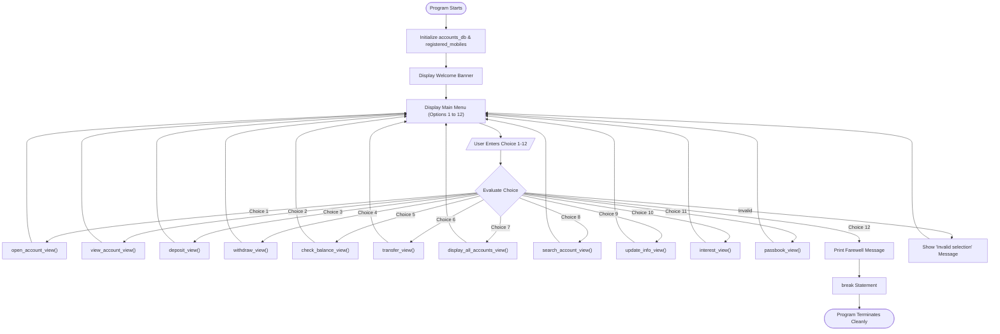
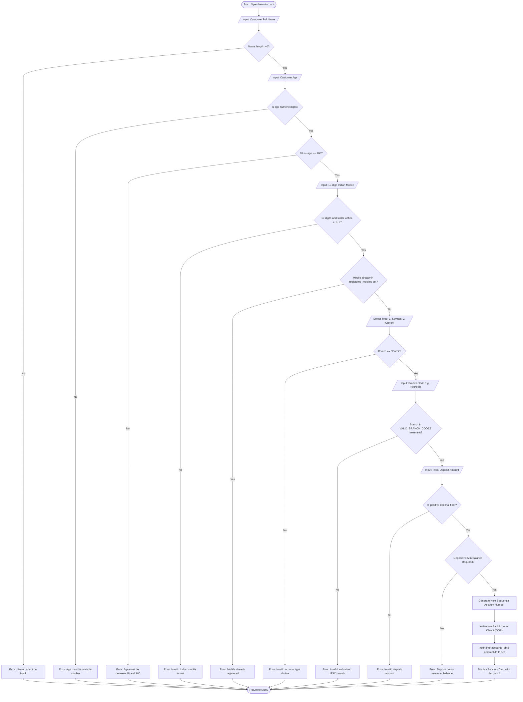
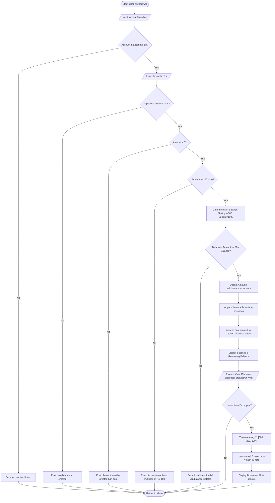
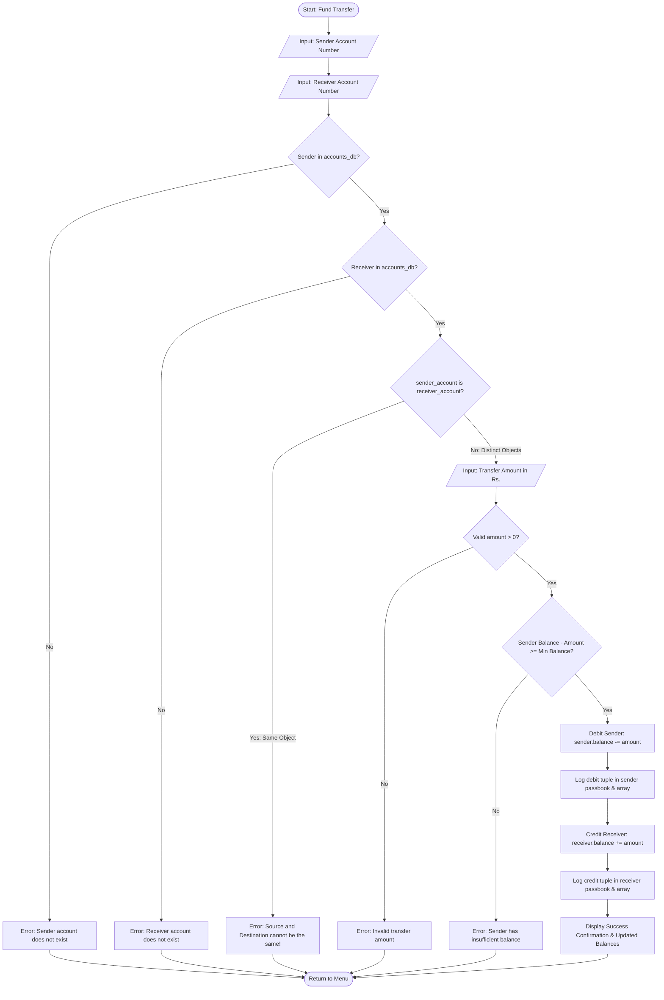
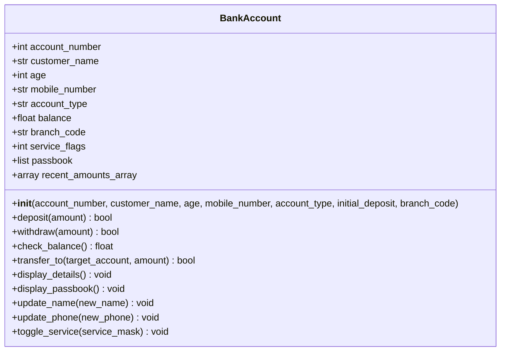
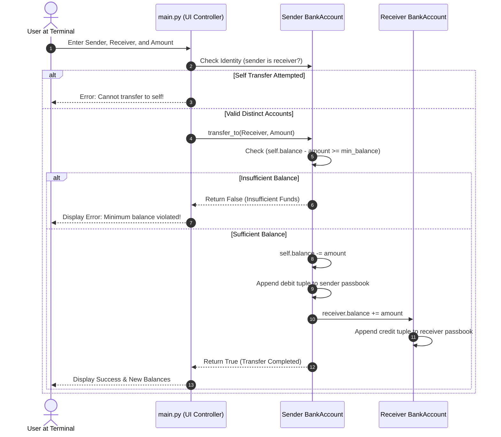

# Indian Banking Management System

## 1. Project Overview

My Indian Banking Management System is a console-based retail banking application created for the Python Essentials flipped classroom continuous evaluation on the VITyarthi portal.

While introducing the "Build Your Own Project" challenge, my professor asked us to focus on any real-world application domain relevant to everyday life in the Indian context. I thought about an Indian trying to open a Jan Dhan savings account, or the process that unfolds when he/she goes to withdraw cash from a local ATM, receives an SMS alert from the bank, or transfers money to their friend:
Strict rules are enforced at each stage:
- You must be an adult ($\ge 18$ years old) to open your own independent account
- Indian mobile numbers must be 10 digits and start only with 6, 7, 8, or 9 (TRAI standards)
- You may not register one mobile number to different customers
- You must always maintain a minimum balance (₹500 for Savings, ₹1000 for Current)

- You may only withdraw cash in multiples of ₹100
- Passbook transactions must forever remain permanent and unalterable once logged
Rather than relying on high-level third-party packages or copy-pasting code that uses tools we haven't even learned yet, I implemented this entire system from scratch using only the 21 fundamental concepts taught in our course syllabus. Built 100% in-memory using only `dict`, `list`, `tuple`, `set`, `frozenset`, and the built-in `array` module, this transparent and clean implementation makes it easier for me to explain my code to the evaluators during my project viva.
---
## 2. Six-Module Project Architecture
To demonstrate proper software engineering practices from day one, I avoided writing everything inside a single file. Instead, I organized my code in 6 distinct Python modules and an automated test harness:

```text
indian-banking-management-system/
│
├── constants.py    # Module 1: Immutable tuples, frozensets, banking thresholds, bitwise masks
├── validators.py   # Module 2: Pure algorithmic input validation (loops, conditions, membership)
├── security_tools.py # Module 3: Bitwise operators (&, |, ^, ~, <<, >>) and security tokens

├── calculations.py  # Module 4: Simple/Compound interest, mixed-type division, array note breakdown
├── bank_account.py  # Module 5: BankAccount class (OOP), passbook tuples, array('d'), seed data
├── main.py      # Module 6: Interactive menu loop (while True) and screen navigation
├── test.py      # Automated manual test runner testing all 6 modules (29 test cases)
├── statement.md    # Problem statement, functional/non-functional requirements & architecture
├── requirements.txt  # Environment requirements (Python Standard Library only)
└── README.md     # Comprehensive academic documentation and syllabus mapping
```
Module Responsibilities:
1. `constants.py`: Centralizes fixed bank rules to avoid "magic numbers", contains an immutable `tuple` for account types and an immutable `frozenset` for branch IFSC codes, and integer powers of 2 for bitwise permission masks
2. `validators.py`: Implements custom validation routines using only basic loops and conditions, avoiding regex or `try-except`
3. `security_tools.py`: Implements digital service permission checks using all 6 Python bitwise operators
4. `calculations.py`: Handles financial formulas including Simple Interest, Compound Interest (for Fixed Deposit growth), Monthly Average Balance (mixed-type division), and ATM note breakdown using Python's `array('i')`
5. `bank_account.py`: Contains the `BankAccount` class with methods for deposits, withdrawals, transfers (with identity checks `is`), passbook tuples, numeric amount arrays (`array('d')`), and initial seed accounts
6. `main.py`: The main application loop. Drives the 12-option terminal interface using a `while True` loop and clean `if-elif-else` branches
7. `test.py`: A standalone test runner executing 29 automated test cases across all modules without requiring any external framework
---
## 3. Visual System Flowcharts & Diagrams
### 3.1 Master Application Navigation Flowchart

---
### 3.2 Account Opening & Validation Flowchart

---
### 3.3 Cash Withdrawal & ATM Note Dispenser Flowchart

---
### 3.4 Inter-Account Fund Transfer Flowchart

---
### 3.5 UML Class Diagram (`BankAccount`)

---
### 3.6 UML Sequence Diagram (Fund Transfer)

---
## 4. Complete 12-Feature Catalog
1. Open New Bank Account: Collects full name, validates age (18–100), checks 10-digit Indian mobile format (starting with 6–9), prevents duplicate phone registration using a `set`, validates branch IFSC codes against a `frozenset`, verifies minimum opening deposit, and generates sequential account numbers.
2. View Account Profile & Audit: Displays account details, inspects runtime variable data types via `type()`, displays bitwise checked digital banking services, and prints an 8-bit security checksum token.
3. Deposit Funds: Credits valid positive rupee amounts, updates balance via `+=`, and appends an immutable record to the passbook.
4. Withdraw Cash & ATM Note Dispenser: Debits cash subject to minimum balance limits and an ATM multiple of ₹100 rule. Offers an optional dispenser view calculating exact ₹500, ₹200, and ₹100 notes dispensed using `array('i')`.
5. Check Account Balance: Shows available balance and computes simulated Monthly Average Balance (MAB) via mixed-type division.
6. Transfer Funds Between Accounts: Moves money between accounts while preventing self-transfers using the identity operator `is`.
7. Display All Registered Accounts: Prints a formatted table of all accounts, total bank deposits, and the bank-wide average balance per account.
8. Search Customer Accounts: Multi-criteria search by Account Number, Name substring (`in`), or Mobile Number using loops with `break` and `continue`.
9. Update Customer Profile & Services: Updates customer legal name, updates mobile phone (with uniqueness checking in `set`), and toggles digital services using bitwise XOR (`^`).
10. Calculate Interest (Simple & Compound): Computes Simple Interest and Compound Interest (Fixed Deposit growth) demonstrating operator precedence. Converts tenure months to whole years (`// 12`) and remaining months (`% 12`).
11. View Passbook Statement: Displays complete transaction history stored as immutable tuples `(txn_id, desc, amount, balance)` and dumps the numeric transaction amount array (`array('d')`).
12. Exit Application: Terminates the menu loop cleanly using `break`.
---
## 5. Python Syllabus Concept Mapping
Every single one of the 21 required topics from our first-year syllabus is authentically demonstrated in this codebase:
| Syllabus Concept | Where Used in Code | Code Snippet / Technical Explanation |
| :--- | :--- | :--- |
| 1. Fundamentals | All modules | Variable naming (`customer_name`, `balance`), data types (`int`, `float`, `str`, `bool`), clear comments. |
| 2. Input/Output Operations | `main.py`, `bank_account.py` | `input("Enter Full Name: ")`, formatted column tables with `print(f"{'Acc No':<10}...")`. |
| 3. Membership Operators | `validators.py`, `main.py` | `char not in "0123456789"`, `mobile_input in registered_mobiles`, `branch in VALID_BRANCH_CODES`. |
| 4. Assignment Operators | `bank_account.py`, `main.py` | `self.balance += amount`, `self.balance -= amount`, `total_bank_reserves += account.balance`. |
| 5. Bitwise Operators | `security_tools.py`, `bank_account.py` | `&` (test flag), `\|` (enable flag), `^` (toggle flag), `~` (invert mask), `<<` & `>>` (shifts). |
| 6. `type()` Function | `bank_account.py:201` | Displays runtime data types: `type(self.account_number).__name__`, `type(self.balance)`. |
| 7. Identity Operators | `bank_account.py:141`, `main.py:236` | `if self is target_account:`, `if target_account is None:` verifying object identity. |
| 8. Arithmetic Operators | `calculations.py`, `bank_account.py` | `+`, `-`, ``, `/`, `//` (notes floor div), `%` (ATM multiples & change), `` (compound growth). |
| 9. Logical OR | `main.py:196` | `if user_choice == "y" or user_choice == "yes":`. |
| 10. Logical NOT | `validators.py`, `main.py` | `if not is_valid_indian_phone(mobile):`, `if not match_found:`. |
| 11. Logical AND | `validators.py:65` | `if age_val >= 18 and age_val <= 100:`, `if len(phone) == 10 and is_only_digits(phone):`. |
| 12. Relational Operators | `bank_account.py`, `validators.py` | `==`, `!=`, `<`, `>`, `<=`, `>=` in validations, balance checks, and loop conditions. |
| 13. Mixed-Type Division | `calculations.py:58` | `balance_val / total_months` where `balance_val` is `float` and `total_months` is `int` yielding `float`. |
| 14. Precedence & Associativity | `calculations.py:38` | `growth = 1.0 + (rate / 100.0)`; `principal (growth time)`. Parentheses override precedence. |
| 15. Type Conversion | `main.py:58-92` | Explicit type casting: `int(age_str)`, `float(deposit_str)`, `str(account_no)`. |
| 16. List Data Structure | `bank_account.py:58`, `main.py:254` | `self.passbook = []` (ledger list), `all_accounts_list = list(accounts_db.values())`. |
| 17. Tuple Data Structure | `bank_account.py:65`, `constants.py:15` | Immutable passbook records `(id, desc, amt, bal)`, `ALLOWED_ACCOUNT_TYPES = ("Savings", "Current")`. |
| 18. Set Data Structure | `bank_account.py:278`, `main.py:69` | `registered_mobiles = set()` enforcing $O(1)$ unique phone number registration. |
| 19. Dictionary Data Structure | `bank_account.py:277`, `main.py:104` | `accounts_db[acc_no] = account` providing $O(1)$ key-value account repository. |
| 20. FrozenSet Data Structure | `constants.py:26` | `VALID_BRANCH_CODES = frozenset({"SBIN001", "HDFC002", "ICIC003", "PNB0004"})`. |
| 21. Control Flow Statements | `main.py:415-453` | `while True` loop, `if-elif-else` branches, nested conditions, `for` loops, `break`, `continue`. |
| 22. Functions & Modularity | All modules | Single-responsibility functions with defined parameters, docstrings, and return values. |
| 23. Modules & Packages | Project Structure | Clean multi-module architecture importing across 6 files. |
| 24. Array Data Structure | `calculations.py:75`, `bank_account.py:62` | `from array import array`; `array('i', [500, 200, 100])` and `array('d', [deposit])`. |
| 25. Object-Oriented Programming | `bank_account.py:35` | `BankAccount` class with encapsulation, state attributes, constructor (`__init__`), and methods. |
---
## 6. Installation & Execution Guide
### Prerequisites
- Python Version: Python 3.8 or higher.
- External Dependencies: None. The project utilizes only Python's built-in standard library (`array`).
### Steps to Run the Banking Application:
```bash
# 1. Clone or navigate to the project directory
cd indian-banking-management-system
# 2. Run the main application
python3 main.py
```
### Pre-Loaded Seed Accounts:
The system initializes with 3 fictional accounts ready for immediate testing:
- Account #1001: Aarav Sharma (Savings Account, ₹15,000.00, SBIN001, Mobile: 9876543210)
- Account #1002: Priya Patel (Current Account, ₹25,000.00, HDFC002, Mobile: 9123456780)
- Account #1003: Rohan Verma (Savings Account, ₹8,000.00, ICIC003, Mobile: 9988776655)
---
## 7. Automated Test Suite (`test.py`)
Because our syllabus restricts us from using external testing frameworks (like `pytest` or `unittest`), I wrote a dedicated manual test harness in `test.py` using pure Python functions, relational checks, and formatted reporting.
### How to Run the Test Suite:
```bash
python3 test.py
```
### Test Suite Execution Output:
```text
=================================================================
INDIAN BANKING MANAGEMENT SYSTEM - AUTOMATED TEST SUITE
Course: Python Essentials (First-Year Student Academic Project)
=================================================================
--- RUNNING VALIDATOR MODULE TESTS ---
[PASS] Test 01: is_only_digits() validation
[PASS] Test 02: is_valid_rupee_amount() validation
[PASS] Test 03: is_valid_indian_phone() TRAI compliance
[PASS] Test 04: is_valid_applicant_age() age boundaries (18-100)
[PASS] Test 05: is_valid_ifsc_branch() frozenset membership
--- RUNNING SECURITY & BITWISE TESTS ---
[PASS] Test 06: check_service_permission() using Bitwise AND (&)
[PASS] Test 07: grant_service_permission() using Bitwise OR (|)
[PASS] Test 08: toggle_service_permission() using Bitwise XOR (^)
[PASS] Test 09: create_security_token() using (<<) and (&)
[PASS] Test 10: generate_audit_checksum() using (>>) and (~)
--- RUNNING CALCULATIONS & ARITHMETIC TESTS ---
[PASS] Test 11: compute_simple_interest() calculation
[PASS] Test 12: compute_compound_interest() exponentiation () & precedence
[PASS] Test 13: compute_monthly_average() mixed-type division (float / int)
[PASS] Test 14: get_cash_notes_breakdown() using array('i'), //, and %
--- RUNNING BANK ACCOUNT OOP TESTS ---
[PASS] Test 15: BankAccount __init__() attributes and type() integrity
Success: Rs. 2000.00 credited successfully.
Updated Available Balance: Rs. 7000.00
[PASS] Test 16: deposit() credits balance and updates state
Deposit Error: Deposit amount must be greater than zero.
[PASS] Test 17: deposit() rejects non-positive amounts
Success: Rs. 1000.00 debited successfully.
Remaining Available Balance: Rs. 6000.00
[PASS] Test 18: withdraw() debits balance successfully
Withdrawal Error: Cash withdrawal must be in multiples of Rs. 100.
[PASS] Test 19: withdraw() enforces multiples of Rs. 100 via modulus (%)
Withdrawal Error: Insufficient funds!
A mandatory minimum balance of Rs. 500.00 is required for Savings accounts.
Current Balance: Rs. 6000.00 | Max Withdrawable: Rs. 5500.00
[PASS] Test 20: withdraw() prevents violating minimum balance threshold
[PASS] Test 21: passbook ledger tracks immutable tuples correctly
[PASS] Test 22: recent_amounts_array tracks amounts in array('d')
Success: Rs. 2000.00 transferred successfully to Account #2002 (Recipient Customer).
Your Updated Balance: Rs. 4000.00
[PASS] Test 23: transfer_to() updates both sender and receiver accounts
Transfer Error: Source and destination accounts cannot be the exact same account!
[PASS] Test 24: transfer_to() prevents self-transfer using identity operator (is)
Transfer Error: Destination account does not exist.
[PASS] Test 25: transfer_to() rejects None destination safely
--- RUNNING SYSTEM INTEGRATION & SEARCH TESTS ---
[PASS] Test 26: setup_initial_bank_data() loads seed accounts & mobile set
[PASS] Test 27: Search by account number in dictionary
[PASS] Test 28: Search by customer name substring ('in')
[PASS] Test 29: update_phone() modifies object state and unique set
=================================================================
TEST SUITE SUMMARY
=================================================================
Total Test Cases Executed : 29
Total Test Cases Passed  : 29
Total Test Cases Failed  : 0
🎉 ALL TESTS PASSED! ALL 6 MODULES FUNCTION WITH 100% INTEGRITY.
=================================================================
```
---
## 8. Sample Terminal Interaction
Here is a verbatim run from testing the application in the terminal:
```text
=======================================================
NAMASTE! WELCOME TO INDIAN BANKING SYSTEM
Course: Python Essentials (First-Year Student Project)
=======================================================
=======================================================
MAIN MENU
=======================================================
1. Open New Bank Account
2. View Account Details
3. Deposit Funds
4. Withdraw Cash
5. Check Account Balance
6. Transfer Money Between Accounts
7. Display All Registered Accounts
8. Search for an Account
9. Update Customer Profile / Services
10. Calculate Interest (Simple & Compound)
11. View Passbook Statement
12. Exit Application
=======================================================
Enter your choice (1-12): 2

--- VIEW ACCOUNT DETAILS ---
Enter Account Number to view: 1001
====================================================

CUSTOMER ACCOUNT PROFILE: #1001
====================================================
Account Holder Name : Aarav Sharma
Customer Age    : 28 years
Registered Mobile  : 9876543210
Account Category  : Savings Account
Branch IFSC Code  : SBIN001
Available Balance  : Rs. 15000.00
----------------------------------------------------
Data Type of Acc No : int
Data Type of Balance: float
----------------------------------------------------
Active Digital Banking Services (Bitwise Checked):
- Internet Banking : Enabled
- ATM / Debit Card : Enabled
- SMS Alerts    : Enabled
- Cheque Book   : Disabled
Security Token (<<, &): 164
Audit Flag Shift (>>) : 3 | Inverted (~): -8
====================================================

Enter your choice (1-12): 4

--- WITHDRAW CASH ---
Enter Account Number: 1001
Enter Amount to Withdraw (Rs., multiple of 100): 1000
Success: Rs. 1000.00 debited successfully.
Remaining Available Balance: Rs. 14000.00
Would you like to view the ATM currency note dispenser breakdown? (y/n): y

ATM Currency Dispenser Output:
- Rs. 500 currency notes : 2
- Rs. 200 currency notes : 0
- Rs. 100 currency notes : 0
```
---

## 9. Academic Limitations & Future Roadmap

### Academic Limitations
1. In-Memory Lifetime: Data disappears when terminal is closed. This is by-design compliance with "no SQL/JSON/CSV"
2. Terminal Only: No Web/Mobile app. This is a console-based command-line application
3. Educational Checksum: Security tokens use bitwise operations rather than cryptographic hashing

### Future Roadmap (Post-Syllabus Scope)
- Database Persistence: SQLite/PostgreSQL connection using Python DB-API
- RESTful API: FastAPI/Flask framework for web service
- Desktop Graphical Interface: Tkinter/PyQt interface design
---

## 10. Syllabus Compliance Checklist

| Category | Disallowed Tool / Technique | Used in Project? | Status / Verification Note |
| :--- | :--- | :---: | :--- |
| Databases | SQL, SQLite, MongoDB, PostgreSQL | NO | 100% in-memory data structures (`dict`, `set`, `list`). |
| Data Science | pandas, NumPy, SciPy | NO | Replaced with standard library `array` and basic arithmetic. |
| Web Frameworks | Flask, Django, FastAPI | NO | Pure CLI terminal execution. |
| GUI Frameworks | Tkinter, PyQt, Streamlit | NO | Pure command-line text interface. |
| File Persistence | JSON, CSV, XML, pickle | NO | In-memory lifetime during application execution. |
| Advanced Features | Decorators (`@decorator`) | NO | Standard methods only. |
| | Generators (`yield`) | NO | Standard lists and loops only. |
| | Lambda functions (`lambda x: ...`) | NO | Explicit named functions only. |
| | Recursion | NO | Iterative algorithms (`while`, `for`) only. |
| | Multithreading / Async | NO | Synchronous, single-threaded execution. |
| | External pip packages | NO | Zero pip dependencies (Standard Library only). |
---

