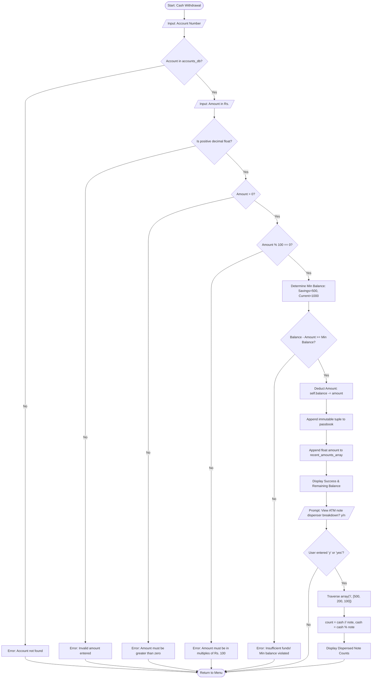
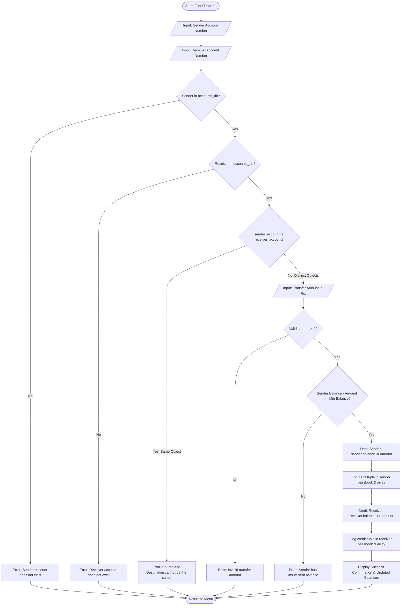
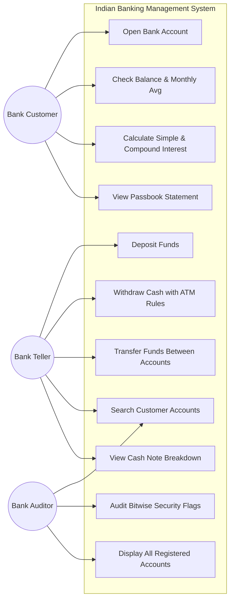
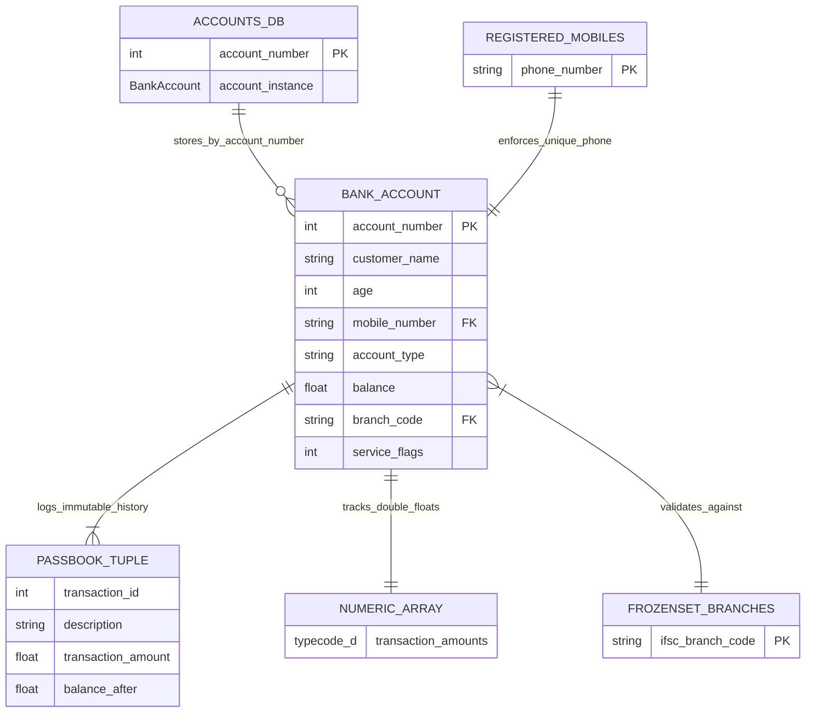

1. Problem Statement

When I entered the first semester of computer science, I realized that most of its programming homework were very isolated. We used to write small programs to find prime numbers, calculate the simple interest or show the if-else condition. Although those exercises helped me familiarize with syntax, they didn't give me much idea on how the real software is written.

I decided to develop an Indian Banking Management System as banks are a part of our daily lives whether its creating a Jan Dhan saving account for your family members or withdrawing money from ATM or transferring money to your friends and relatives, all these work are governed by very strict rules.

1. Age requirement - According to Indian banking rules, only those who are above 18 years can open an independent bank account.
2. Controlled Mobile Verification: Indian mobile numbers adhere to National Numbering Plan by the Telecom Regulatory Authority of India (TRAI)- which requires an exact 10 digit number with first digit being 6,7,8,9.
3. One Mobile number per customer: Not even two individual consumers can have two distinct accounts using the same mobile number.
4. Lowest Balance The account will be operating with a minimum balance of (e.g. 500) for Save accounts and (e.g. 1000) for Current accounts or they are included in the current balance.
5. Physical ATM Denomination Requirement: ATM machines cannot give you 237 or 480 rupees, you need to give them 500/200/100 notes to be able to extract money in. You have to withdraw in multiples of 100s.
6. Immutable Ledgers of the Transactions: The passbook of a bank is authentic documentation of the financial transactions of it. Once the transaction is done whether you deposited money or whether you took out money, it should be always kept unfaltering.

Commercial core-banking software (like the TCS BaNCS or Infosys Finacle) have billions of lines of proprietary code on top of distributed servers, enterprise data, and security infrastructure. It's not possible for a first-year undergraduate to try and learn those systems. Conversely, many student projects online just copy code that uses high-end third-party packages (like Pandas, SQLite, or Tkinter), don't understand the basic algorithms, or resort to unsafe shortcuts that'll give a headache for every unanticipated user input.

# The Core Challenge

And...the first question I decided to answer was: How to develop an entirely new, functional Indian retail banking system that is: 1. Entirely developed from scratch using only the 21 basic Python concepts I have studied in my course.2. Crash proof, modular and easily understandable.

This is my project, it is terminal based, relies exclusively on in-memory native data structures, relies exclusively on algorithmic validation rather than regex or try-except, permission management by using binary bitwise flags, comes with an end-to-end set of test cases.

---

2. Project Objectives

This project had four concrete goals, which I have set out below:

6. "Show Indian Model Process" 1. Model Authentic Indian Retail Banking Process Model 2. Interest Calculation Model based on Savings & Current account rules 3. TRAI enabled Mobile validation 4. IFSC branch check for authorization 5. ATM disbursement of notes 6. Simple & Compound interest estimation 7. Show Indian Model Loan Process 7. "He Explain Indian Models" 1. Indian Modular AR (Application Refund) System Model 2. Indian Modular HP (Home Payment) System Model 3. Indian Modular BO (Bill of Ori) System Model 4. Indian Modular BI (Bill of Income) System Model 5. Indian Modular C (Cash Delivery) System Model 6. Indian Modular I (Investor Model) 7. Indian Modular RE (REBanking Model)
2. Use Our 100% Course Syllabus: Incorporate all of our topics-variables and operators; I/O, arithmetic, comparison, logical, bitwise, identity and membership operators; mixed-type division; precedence; type conversions; core data structures (list, tuple, set, dict, frozenset, array); control flow; modular functions; and object-oriented programming-you'll teach whatever I throw at you, it's all there.
3. Create a 6-Module Decoupled System: Don't put everything in one file. Write a set of 6 modular, concise pieces of code plus an automated test suite, to show clear separation of concern and high readability.
4. Impose Algorithmic Defences. For example, insipid validation functions with for loops, simple if statements, & character checking, along with conditionals, can remove unspent data from anywhere in the app, and are safe. They can lose data in the number field, negative amounts, overdrafters, and multiple decimal dots, without losing the app.

---

3. Scope of the Project

# 3.1 What is In-Scope

Product 2Current Accounts Account range Acquisition 4 Account current Opening Saving and Current accounts with the automatic sequential account number generationand first Deposit validation account.
– Financial Transactions: Deposits, ATM withdrawal with ATM denomination rules, and peer to peer transfers to another account with identity verification.
- Account Inquiries & Report: Balances available accounts, computes use based on simulated MAB, examines each passbook table when account by account, and produces banking table reset reserve averages and remaining balances.
- Multi-Criteria Account Search: Retrieve customer details by Account Number, Name (case-insensitive partial match), Mobile Number using loops & break/continue.
- Digital Banking function rights - Packing customer service access points (Net Banking, ATM Card, SMS Alerts, Cheque Book) into bitwise flags and creating security check sum tokens in 8 bit.
- ATM: Splitting the amount withdrawal into 500, 200 and 100 notes using the array package of python by standard python array package by array, with floor division and modulus.
- Interest Calculation: Calculation of Simple Interest on savings and Compound Interest on FD growth with the distinction of explicit operator precedence.
- Automated Test Runner: A single test.py file that runs 29 automated test cases on all modules with no third-party libraries.

# 3.2 Out-of-Scope (The Deliberate Demarcation of Academia)

- External Database Persistence: No SQL, SQLite, MySQL, MongoDB. Data stored in memory (RAM) during program execution to ensure one has mastered native data structures in python.
- Web & Mobile Frameworks: Flask, Django, FastAPI, HTML, CSS - none of these are used. The app will run completely in command-line terminal mode.
- Graphical User Interfaces (GUI) No Tkinter or PyQt project remains truly lightweight and portable; can run on all operating system environments with no dependencies.
- Advanced Python Metaprogramming - No decorators (@), generators (yield), lambda, recursion or multithreading, so that the code is crystal clear and can be explained by a first-year student.

4. Target Users

User Persona Acting as Real-World Function How They Collaborate with the System User Persona Acting as Real-World Role How Users Work with the System

|:--- |:--- |:--- |

| Bank Customer | Everyday Account Holder | Opens an account, deposits their savings, checks for their available balance, estimates the returns they will get from their Fixed Deposit, and reviews his passbook statement. |
| Bank Teller / Cashier | Branch Front-Desk Employee | Performs cash deposits and withdrawals, verifies balance limits in force, and checks the currency note composition issued to the customer. |
| Branch Compliance Auditor | Security & Audit Officer | Checks bitwise security service flags, audits checksum tokens, confirms branch ifsc code, and writes bankwide deposit reserves & average. |
Test Class / Person Grade obtain set in the test Test method4 test constant, pathpass1, Test Path Name description:Test to clone repo, look through for syllabus
You are asked by you:To humanize the above the following into till you sound. Keep every single fact and the original length.

---

5. Functional Requirements (Module Breakdown)

# M1: constants.py (Set Rules & Settings)

- FR-1.1: The system shall establish a set of non-derivable account types which are fixed, to be stored in an unchangeable tuple ("Savings", "Current").
- FR-1.2: System shall ensure the validity of the balance of either account 500.00 for savings or 1000.00 for current.
- FR-1.3: Must be stored for validated bank branch IfsC codes of Indian banks in the unaffordable set (frozen set).
- FR-1.4: The system shall establish distinguishable bitwise powers of 2 (1, 2, 4, 8) for the authorisation of digital banking services.

# Module 2: validators.py (Input Verification)

- FR-2.1: For input validation of a string of 0–9 characters, test each character individually with a for loop and the membership operator (e.g. Not in "0123456789").
- FR-2.2: Validation of decimal rupeee in each of the amount (positive) with maximum one decimal.
- FR-2.3 – As between the number of digits and the values of the number, ensure 10 digit indian mobile number ensuring that all characters are digits and the first digit are specifically ("6", "7", "8", "9") as TRAI guidelines.
- FR-2.4 Customer age limit of 18-100 by relational operators (>=, <=) and logical and.
- FR-2.5: Confirm entered branch codes exist in the authorized frozenset using the membership operator `in`.
# Module 3: security_tools.py (Bitwise Security)

- FR-3.1: Check if a service is running using the Bitwise AND operator (&).
- FR-3.2: Set a service flag without affecting other active flags using the bitwise OR operator (|) through the -int() call.
- FR-3.3: I can flip or toggle a service ON or OFF using Bitwise XOR operator ( ^ ).
- FR-3.4: Derive an 8-bit security checksum token using Bitwise Left Shift (<< 2) and Bitwise AND mask (& 255).
FR-3.5 Use Bitwise Right Shift (>> 1) and Bitwise NOT inversion (~) to create security audit diagnostics.

# Module 4: calculations.py (Financial Mathematics)

- FR-4.1: Find Simple Interest: $\text{SI} = \frac{P \times R \times T}{100}$.
- FR-4.2: Write a program to calculate and demonstrate compound interest with the help of Fixed Deposit (FD) simulation: $A = P \times (1 + \frac{R}{100})^T$ with show case of ` (exponentiation) and the usage of parenthesis.
2. FR-4.3 - Calculate Monthly Average Balance with mixed type division (float(balance) / int(months)).
- FR-4.4: Breakdown disbursement of cash currency note counting into 500,200, and 100 cash currency notes using common library array('i'), //, and %.

# Module 5: bank_account.py (Core Account Operations)

- FR-5.1: Encapsulate customer info, balance, flags, passbook, and numeric array in the class Bank Account.
- FR-5.2: Deposit credit with self.balance += amount, reject amounts $\le 0$.
- FR-5.3: Debit withdrawals using self.balance -= amount, respecting minimum bounds and 100 multiples.
- FR-5.4: When performing a transfer between two accounts, the owner of the source account should be prevented to execute transfer-to-self, here using the identity operator is.
- FR-5.5: Record all successful transactions in the immutable passbook as a tuple - (txnid, description, amount, balanceafter).
- FR-5.6: Save transaction numbers in a memory-efficient list of numbers (e.g., "array" from standard Python library) array('d').
- FR-5.7: Seed 3 realistic accounts on startup for ready to go testing.

# Module 6: main.py (Terminal Interface)

- FR-6.1: Demonstrate a menu loop with 12 options in a interactive loop using while True.
- FR-6.2: Cleanly select the route user using an if-elif-else control ladder.
- FR-6.3: Enable multi-criteria searches on Accounts (Account Number, Name partial, or Mobile Number) with while loops using break and continue.
- FR-6.4: Table account summaries bank reserves by total reserve, bank account holdings, bank wide averga sum of account holdings.
- FR-6.5: Exit on Option 12 cleanly with break.

---

6. Non-Functional Requirements

To satisfy the requirements of section 2.2 of the VITyarthi submission guidelines, I considered the following five non-functional criteria while designing and testing the system:

| Requirement | Tier | Target Metric | How This was Achieved in Code |
| Will I experience side effects? | How do I stop side effects? | How long do I wait before I can get another test or vaccine for COVID-19? | How long do I have to wait to get another vaccination? | Last updated: October 16, 2023 | Source: Centers for Disease Control and Prevention 2 / 3. Learn more about possible side effects of montelukast. Find out how to handle side effects and when you should contact your healthcare professional. Learn when you can get another test for COVID-19 and how to stay up-to-date on COVID-19 vaccines.
| NFR-1 | Usability | Clear CLI experience | – cli_help (help description) – user tasks with brief descriptions – Help example for a specific user task – user prompt with explicit units (e.g. (multiple of 100)) – Reason for rejecting a set of values – Clear tables of values for 80-column terminal display |
| NFR-2 | Performance | Sub-millisecond latency | In-memory dictionary lookups for accounts are at $O(1)$ time; check whether a mobile number is a duplicate using a set takes at $O(1)$ time; test suite executes in < 0.05 second. |
| NFR-3 | Data Integrity | Zero false state change | Passbook history stored in the form of immutable tuples; transfer accounts verify that sender and receiver are distinct object identities (no self transfers); bitwise isolation to prevent flag tampering. |
| NFR-4 | Maintainability | High cohesion, loose coupling | 6 distinct single-responsibility modules; descriptive student variable naming; zero circular dependencies; comprehensive inline comments. |
| NFR-5 | Resource efficiency | Reduced hardware requirements | Fully dependency-free (i.e., no pip packages); frugal numeric data storage; resource usage (memory): maximum RAM usage < 25 MB. |

---

7. System Architecture & Detailed Flowcharts

# 7.1 High-Level Architecture Flowchart

`mermaid

flowchart TD

subgraph Presentation_Layer["Presentation Layer (CLI)"]

UI["main.py: 12-Option Menu Loop"]

end

subgraph Service_Layer["Service & Utility Layer"]

VAL["validators.py: Algorithmic Input Validation"]

SEC["security_tools.py: Bitwise Operations & Security Tokens"]

CALC["calculations.py: Financial Math & Array Dispenser"]

end

subgraph Core_Layer["Business Domain Layer"]

ACC["bank_account.py: Bank Account Class & Seed Accounts"]

CONST["constants.py: Rules, Tuples & Frozenset"]

end

subgraph Storage_Layer["In-Memory Data Structures"]

DICT[("accounts_db: Dictionary")]

MSET[("registered_mobiles: Set")]

TUP[("passbook: List of Tuples")]

ARR[("recent_amounts: Array 'd'")]

FSET[("VALIDBRANCHCODES: Frozen Set")]

end

UI --> VAL

UI --> SEC

UI --> CALC

UI --> ACC

ACC --> CONST

VAL --> CONST

SEC --> CONST

ACC --> DICT

ACC --> MSET

ACC --> TUP

ACC --> ARR

CONST --> FSET

`

---

# 7.2 Main Program Navigation Flowchart

`mermaid

flowchart TD

Start([Program Starts]) --> Load Data["Initialize accountsdb & registeredmobiles"]

Load Data --> Show Banner["Display Welcome Banner"]

Show Banner--> Menu Loop["Display Main Menu (Options 1 to 12)" ]

Menu Loop --> Read Choice[/User Enters Choice 1-12/]

Read Choice --> Route Choice{Evaluate Choice}

Route Choice -->|Choice 1| Open Acc["openaccountview()"]

Route Choice -->|Choice 2| View Acc["viewaccountview()"]

Route Choice -->|Choice 3| Dep Funds["deposit_view()"]

Route Choice -->|Choice 4| With Cash["withdraw_view()"]

Route Choice -->|Choice 5| Chk Bal["checkbalanceview()"]

Route Choice -->|Choice 6| Xfer Money["transfer_view()"]

Route Choice -->|Choice 7| Disp All["displayallaccounts_view()"]

Route Choice -->|Choice 8| Search Acc["searchaccountview()"]

Route Choice -->|Choice 9| Update Info["updateinfoview()"]

Route Choice -->|Choice 10| Calc Int["interest_view()"]

Route Choice -->|Choice 11| View Pass["passbook_view()"]

Route Choice -->|Choice 12| Exit Prog["Print Farewell Message"]

Route Choice -->|Invalid| Show Err["Show 'Invalid selection' Message"]

Open Acc --> Menu Loop

View Acc --> Menu Loop

Dep Funds --> Menu Loop

With Cash --> Menu Loop

Chk Bal --> Menu Loop

Xfer Money --> Menu Loop

Disp All --> Menu Loop

Search Acc --> Menu Loop

Update Info --> Menu Loop

Calc Int --> Menu Loop

View Pass --> Menu Loop

Show Err --> Menu Loop

Exit Prog --> Break Loop[break Statement]

Break Loop --> End([Program Terminates Cleanly])

`

---

# 7.3 Account Opening & Validation Flowchart

`mermaid

flowchart TD

Start Open([Start: Open New Account]) --> InName[/Input: Customer Full Name/] --> Show table Show table of contents Add to Contents. By: Subscribe Select Add to Contents.
 InName --> Chk Name{Name length > 0?}
Chk Name -->|No| Err Name["Error: Name cannot be blank"] --> End Open([Go back to Menu])

Chk Name -->|Yes| InAge[/Input: Customer Age/]

InAge --> Chk Age Num{Is age numeric digits?}
Chk Age Num -->|No| Err Age Num["Error: Age must be a whole number"] --> End Open
 Chk Age Num -->|Yes| Chk Age Range{18 <= age <= 100?}
Chk Age Range-->|No| Err Age Range ["Error: Age should be between 18 and 100"]--> End Open

Chk Age Range -->|Yes| InMobile[/Input: 10-digit Indian Mobile/]
InMobile --> Chk Mobile Len{10 digits and begins with 6, 7, 8, 9?}
Chk Mobile Len -->|No| Err Mobile Val["Error: Invalid Indian mobile format"] --> End Open
 Chk Mobile Len -->|Yes| Chk Mobile Unique{Mobile already in registered_mobiles set?}
Chk Mobile Unique -->|No| Err Mobile Dup["Error: Mobile already used"] --> End Open

Chk Mobile Unique -->|No| InType[/Select Type: 1. Savings, 2. Current/]

InType --> Chk Type{Choice == '1' or '2'?}
Chk Type -->|No| Err Type["Error: Invalid type of account"] --> End Open

Chk Type -->|Yes| InBranch[/Input: Branch Code e.g., SBIN001/]

InBranch --> Chk Branch{Branch in VALIDBRANCHCODES frozenset?}

Chk Branch -->|No| Err Branch["Error: Invalid authorized IFSC branch"] --> End Open

Chk Branch -->|Yes| InDeposit[/Input: Initial Deposit Amount/]

InDeposit --> Chk Deposit Num{Is positive decimal float?}
Chk Deposit Num -->|No| Err Dep Num["Error: Invalid deposit amount"] --> End Open

Chk Deposit Num -->|Yes| Chk Min Dep{Deposit >= Min Balance Required?}

Chk Min Dep -->|No| Err Min Dep["Error: Deposit below minimum balance"] --> End Open

Chk Min Dep -->|Yes| GenAccNo["Generate Next Sequential Account Number"]

GenAccNo --> Make Obj["Instantiate Bank Account Object (OOP)"]

Make Obj --> Save State["Insert into accounts_db & add mobile to set"]

Save State --> Show Success["Display Success Card with Account #"]

Show Success --> End Open

``

---

7.4 Cash withdrawal and ATM note dispenser flowchart

---

7.5 Fund transfer and object identity verification flowchart

---

7.6 Role based use case diagram

---

7.7 In-Memory Storage Schema (ER Diagram)

---

8. Summary of Alignment with Course Syllabus

Syllabus Concept Implementation in Code Educational Rationale
Python fundamentals Clean variable naming; numeric/string literals; inline comments. Demonstrates code clarity and beginner programming discipline.
Input & Output `input()` for user entries; formatted column tables via `print()`. Builds interactive, professional console applications.
Membership Operators `char not in "0123456789"`, `mobile in registered_mobiles`. Fast collection membership testing.
Assignment Operators `self.balance += amount`, `self.balance -= amount`. Concise arithmetic state modification.
Bitwise Operators `&` (test), `\|` (enable), `^` (toggle), `~` (invert), `<<`, `>>` (shifts). High-efficiency flag compression.
`type()` Function `type(self.account_number).__name__`, `type(self.balance)`. Runtime type inspection.
Identity Operators `if self is target_account:`, `if target_account is None:`. Memory reference equality checking.
Arithmetic Operators `+`, `-`, ``, `/`, `//` (note counts), `%` (ATM multiples), `` (growth). Complete mathematical modeling.
Precedence & Division `((1.0 + (R / 100.0)) T)`; mixed-type division `float / int`. Understanding Python expression evaluation.
Type Conversion Explicit casting with `int()`, `float()`, `str()`. Transforming raw string inputs into mathematical types.
Core Data Structures `dict` (accounts), `list` (collections), `tuple` (passbook), `set` (mobiles), `frozenset` (branches), `array` (notes & amounts). Matching the exact right data structure to the engineering problem.
Control Flow `while True` loop, `if-elif-else` routing; `for` loops; `break`, `continue`. Algorithmic logic and safe menu navigation.
Functions & Modules 6 logical Python files with single-responsibility functions. Clean modular software architecture.
Object-Oriented Prog. `BankAccount` class encapsulating attributes and methods. State encapsulation and object modeling.
Automated Testing `test.py` running 29 automated test cases. Verifying software correctness without external frameworks.